# Fluxo de operação do pipeline editorial

Este diagrama representa o estado atual do projeto. A distinção principal é:

- **Manual:** uma pessoa invoca a etapa, toma a decisão ou autoriza a mutação.
- **Automatizado:** scripts e skills executam a sequência, validações e persistência
  depois da invocação manual.
- **Gate humano:** o sistema para e depende de decisão explícita da pessoa.
- **Não ativo:** automação recorrente ainda não está habilitada.

```mermaid
flowchart TD
    START([Invocação humana explícita])

    subgraph B1[Bloco 1 — Pesquisar e escolher]
        D[discover-signals<br/>coleta de sinais]
        A[analyze-discussions<br/>opcional]
        C[cluster-signals<br/>agrupar sinais]
        S[score-opportunities<br/>pontuar oportunidades]
        Q1[(Backlog<br/>ready_for_research)]
        D --> A --> C --> S --> Q1
    end

    subgraph B2[Bloco 2 — Gerar o post]
        BATCH[run-editorial-batch<br/>fila congelada + checkpoints]
        R[research-topic<br/>gera brief]
        BG[brief_review_gauntlet]
        W[write-post]
        CG[critique + correction_gauntlet]
        H[humanize passes + reviews]
        Q2[(Draft<br/>content/drafts/)]
        BATCH --> R --> BG --> W --> CG --> H --> Q2
    end

    subgraph B25[Bloco 2.5 — QA]
        QA{Decisão humana sobre o draft}
        EDIT[Solicitar modificação<br/>ou editar diretamente]
        APPROVE[Aprovar e autorizar agendamento/publicação]
        DISCARD[Descartar]
        QA -->|modificar| EDIT --> Q2
        QA -->|aprovar| APPROVE
        QA -->|descartar| DISCARD
    end

    subgraph B3[Bloco 3 — Publicar/agendar]
        OPEN[CUA embedded browser<br/>abrir/selecionar aba]
        SHOT[Screenshot obrigatório]
        NATIVE[Visão nativa<br/>localizar e confirmar elementos]
        IA{Visão nativa disponível?}
        ANALYZER[image-analyzer<br/>somente se necessário]
        PW[Playwright<br/>terceira rota]
        MUT[Mutação autorizada<br/>publicar/agendar/reagendar]
        VERIFY[Confirmar toast + lista de<br/>Publicações agendadas]
        MOVE[(Mover arquivo para<br/>content/published/)]
        OPEN --> SHOT --> NATIVE --> IA
        IA -->|sim| MUT
        IA -->|não ou falhou| ANALYZER
        ANALYZER -->|concluiu| MUT
        ANALYZER -->|não concluiu| PW --> MUT
        MUT --> VERIFY --> MOVE
    end

    REG[Atualizar marker +<br/>scheduling-registry.yaml]
    STOP([stop / fail-closed])
    AUTO[Automação recorrente<br/>não ativa no estado atual]

    START --> D
    Q1 -->|invocação posterior| BATCH
    Q2 --> QA
    APPROVE --> OPEN
    MOVE --> REG
    VERIFY -.falha ou estado ambíguo.-> STOP
    MUT -.mutação ambígua.-> STOP
    AUTO -.adiada.-> STOP

    classDef manual fill:#fff7ed,stroke:#f97316,color:#7c2d12,stroke-width:2px
    classDef automated fill:#ecfdf5,stroke:#10b981,color:#064e3b,stroke-width:2px
    classDef gate fill:#fef2f2,stroke:#ef4444,color:#7f1d1d,stroke-width:2px
    classDef artifact fill:#eff6ff,stroke:#3b82f6,color:#1e3a8a,stroke-width:2px
    classDef deferred fill:#f1f5f9,stroke:#64748b,color:#334155,stroke-width:2px,stroke-dasharray:5 5

    class START,QA,EDIT,APPROVE,DISCARD manual
    class D,A,C,S,BATCH,R,BG,W,CG,H,OPEN,SHOT,ANALYZER,PW,MUT,VERIFY,REG automated
    class IA,STOP gate
    class Q1,Q2,MOVE artifact
    class AUTO deferred
```

## Resumo do estado atual

| Área | Manual | Automatizado | Estado |
|---|---|---|---|
| Pesquisa e escolha | Invocar o bloco e decidir quando aprofundar | Coleta, clusterização, scoring e persistência | Ativo |
| Geração do post | Invocar o lote | Fila congelada, checkpoints, gauntlets e falha isolada | Ativo |
| QA | Ler, aprovar, pedir alteração ou descartar | Validações de contrato e persistência | Gate humano obrigatório |
| Publicação/agendamento | Autorizar a mutação e o horário | Navegação assistida, screenshots, validação e registro | Ativo, com sessão logada |
| Automação recorrente | Definir/autorizar quando retomada | Execução hospedada independente | Não ativa; adiada |

## Regra de fronteira

Nenhum bloco chama automaticamente o bloco seguinte. A pessoa invoca cada rodada,
e o sistema só avança depois dos gates definidos para aquela fronteira.
